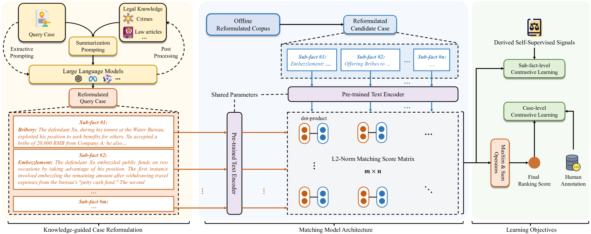

<div align="center">
<h1>Learning Interpretable Legal Case Retrieval via Knowledge-Guided Case Reformulation[<a href="https://arxiv.org/abs/2406.19760">Paper</a>]</h1>

</div>

KELLER, a legal knowledge-guided case reformulation approach based on large language models (LLMs) for effective and interpretable legal case retrieval.

## Usage
```python
# Single GPU
export CUDA_VISIBLE_DEVICES=0
python run.py --config_path ./config/KELLER.yaml
```

```python
# Multi GPUs
export CUDA_VISIBLE_DEVICES=0,1,2,3,4,5,6,7
torchrun --nproc_per_node=8 run.py --config_path ./config/KELLER.yaml
```
or simply run the shell script:
```shell
bash run.sh
```

## Data
Most of the data has been released in this repo, and others can be found (or processed) by:

- The `unique_candidates.json` of the LeCaRD dataset can been easily produced by merging docs according to their doc_ids.
- The `ori_candidates` dir is the original candidate dir of the LeCaRDv2 dataset.

## Citation
```
@article{DBLP:journals/corr/abs-2406-19760,
  author       = {Chenlong Deng and
                  Kelong Mao and
                  Zhicheng Dou},
  title        = {Learning Interpretable Legal Case Retrieval via Knowledge-Guided Case
                  Reformulation},
  journal      = {CoRR},
  volume       = {abs/2406.19760},
  year         = {2024},
  url          = {https://doi.org/10.48550/arXiv.2406.19760},
  doi          = {10.48550/ARXIV.2406.19760},
  eprinttype    = {arXiv},
  eprint       = {2406.19760},
  timestamp    = {Wed, 24 Jul 2024 22:02:55 +0200},
  biburl       = {https://dblp.org/rec/journals/corr/abs-2406-19760.bib},
  bibsource    = {dblp computer science bibliography, https://dblp.org}
}
```